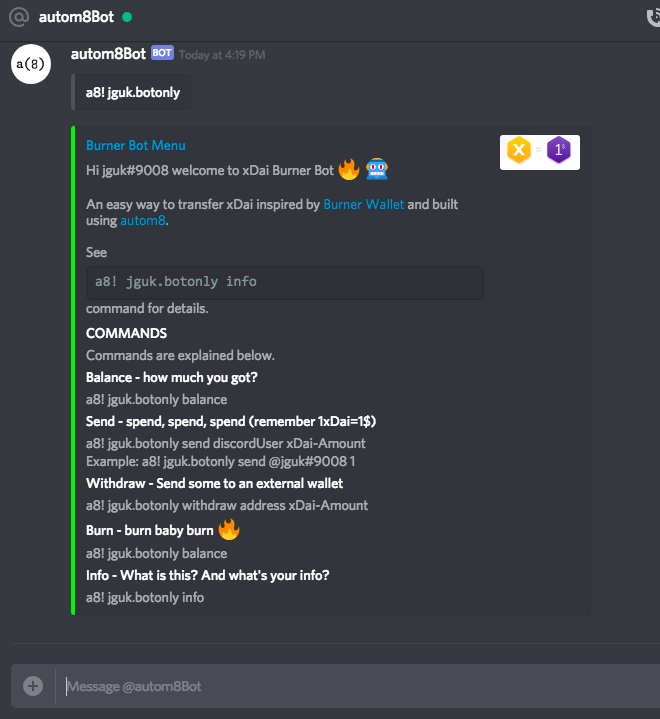

## Burner Bot

Burner Bot is an easy way to transfer xDai inspired by [Burner Wallet](https://github.com/austintgriffith/burner-wallet) and built using [autom8](https://gitlab.com/autom8.network/docs).

The Burner Bot was made during the The Ethereal Hackathon. The aim was to make something like the Burner Wallet which provides a quick and easy way to carry and exchange small amounts of spending-crypto using a mobile browser but in this case it's done on Discord using [autom8](https://gitlab.com/autom8.network/docs) technology. Just like the Burner Wallet this version uses xDai Chain for 1:1 with Dai, low gas fees and quick block times.

Security - Some things to note",
A burner wallet is analogous to cash; you won’t carry too much because it can be lost but it’s astonishingly easy to exchange.

Increased convenience comes at a security cost – the “burner” part of the wallet’s name exists to remind users that it’s not secure
for long-term storage. If you use a Burner Wallet, you should regularly sweep funds into a more secure wallet and burn your Burner Wallet’s private key (you can always make a new one).

In this version the private key is stored on a [central server](https://github.com/johngrantuk/burnerbotserver) which isn't cool but it was a quick way to get something going and for now this is just for fun! The bot queries the server for the account info based on the Discord username. In the future I think something nice could be done to handle private keys using NuCypher tech.
